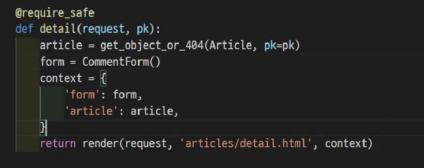
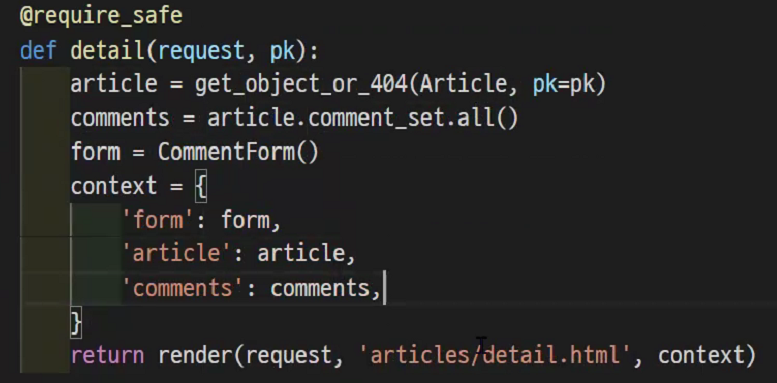

```
models.py에 아래내용을등록
class Comment(models.Model):
	article = models.ForignKey(Article, on_delete=models.CASCADE)
	# CASCADE : 부모객체가 삭제됐을때 이를 참조하는 객체도 삭제
	# PROTECT : 참조가 되어있는 경우 오류 발생
	# SET_NULL : 부모 삭제시 모드 NULL로 치환(NOT NULL조건이면 불가능)
	# SET_DEFAULT : 모든값이 디폴트로 치환
```

모델즈작성하고

 urls에

```
path('<int:pk>/comments/', views.comments_create, name='comments_create'),

views.py

def comments_create(request):
	article = get_object_or_404(Article, id=pk)
	if request.method=='POST'
		pass
	else:
		form = CommentForm()
		# 이거쓰려먼 맨위에 추가해줘야함 commentform
	
	context = {
		'form' : form,
		'article' : article
	}
	return render()
	
# 이내용을 디테일에서 처리할 수 있다. 위의내용 주석해부러~
```




디테일.html에 댓글폼 생성

```
ul태그안에
for comment in comments
li태그{{comment.content}}
endfor


<form action="" method="POST"
	
	{{ form.as_p }}
	<button>댓글 작성</button>
</form>
```


g하지만 위의내용 주석한거 다시불러와

```
def comments_create(request):
	article = get_object_or_404(Article, id=pk)
	if request.method=='POST'
		form = ComentFrom(request.POST)
		if form.is_valid():
			comment = form.save(commit=False)
			comment.article = article
			comment.save()
			return redirect('articles:detail', pk)
	else:
		form = CommentForm()
		# 이거쓰려먼 맨위에 추가해줘야함 commentform
	
	context = {
		'form' : form,
		'article' : article
	}
	return render()
```




```
ul태그안에
for comment in comments
li태그{{comment.content}}

form csrf button x

endfor
```

