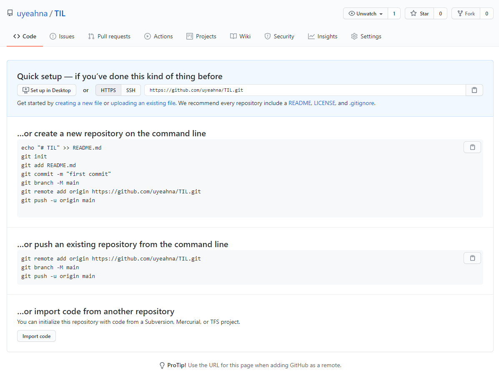
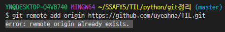

### git

> 분산 버전 관리 시스템으로 코드의 과거내역을 저장한다.
>
> 과거내역을 복원하고 변경사항을 비교, 분석, 병합까지 가능하다.


### 명령어

> `ls` : 현재 경로에 무슨 파일이 있는지 확인
>
> `cd + 폴더명` :  폴더명으로 이동하기
>
> `cd .` : 현재폴더
>
> `cd ..` : 상위폴더로 이동
>
> `mkdir` : 폴더 생성하기
>
> `touch + 파일명` : 파일 생성하기


> #### 파일 올릴 때 필요한 과정
>
> `$ git init` : 현재폴더부터 하위폴더모두 git으로 관리할 예정이라는 뜻. 완성하면 `폴더경로 + (master)` 이렇게뜬다.
>
> `$ git config --global --list` : 설정확인
>
> `$ git config -- global user.email uyeahna@gmail.com` : 이메일 삽입
>
> `$ git config --global user.name yn` : 이름 삽입
>
> `$ git status` :  상태 확인 👉 `untracked files` : 관리 목록에 등록되지않은 파일이 있다 👉 `add`를 써라
>
> `$ git add .` :  현재폴더 (하위폴더) 를 모두 git 으로 관리하겠다.
>
> `$ git commit -m 'first commit` : 메세지 전송하기
>
> `$ git remote add origin https://github.com/uyeahna/testgit.git`  : 목록에 올리기
>
> `$ git push -u origin master` : 로그인하기




*정 모르겠으면 이거보고 따라해보자...*


> `$ git rm --cached 파일명` : 올린거 취소하기
>
> `$ git clone` : 복제해오기 ( 인터넷에 있는 파일을 복제할거)


#### Error



```bash
$ git remote rm origin
$ git remote add origin https://github.com/uyeahna/TIL.git
$ git remote -v
$ git push origin master
```

이렇게 해결~~


*아직 익숙치 않아서 파일을 올리고내리는데에 많이 애먹지만 자주 사용하다보면 눈감고도 할 수 있게 되리라고 믿는다.. 그때까지 화이팅 ㅜ.ㅜ*

