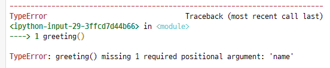

# 함수

> 반복적인 흐름을 재 사용 가능하도록 만들어둔 것,
>
> 함수값은 한 개의 객체만 반환된다.
>
> 
>
> `return` : 함수값을 반환해줌 👉 없으면 `None` 반환(python에서는)
>
> `return` 과 `print` 의 차이 :  `return`은 저장할 뿐 값을 출력해주지는 않는다.`print`는 값이 출력된다.
>
> `print` : 는 None 을 반환함 
>
> - `a.sort` : 원본을 바꾸고 `return` 값이 없음
>
> - `sorted` : 원본은 그대로 `return` 으로 정렬된 리스트 반환
>
>   
>
>   
>
>   Error 👉 greeting 함수는 하나의 요구된 위치 인자값인 name이 필요하다
>
>   


## 함수의 입력

##### 매개변수, 전달인자

>```python
>def function(x): # 함수 선언
>    return x + 2 # x(매개변수)값 받아서 출력
>
>function(2) # 함수 사용
>```


### 함수의 인자

##### 위치인자, 기본인자

> 기본인자 뒤에 기본이 아닌 인자가 올 수 없다.
>
> ```python
> def hellp(a, b): # 위치인자만
> 
> def hello(a='이름없음', b): # (기본인자, 위치인자) 문법오류
> def hello(a, b='나이모름'): # (위치인자, 기본인자) 가능
> ```


##### 키워드 인자

>순서 상관없이 넣어줄 수 있다.
>
>```python
>def hello(name, age):
>hello(age=1000, name='예나') # 키워드에 직접 넣어주는거라 순서 상관없이 가능하다.
>```
>
>키워드인자를 사용한 뒤 위치인자는 사용이 불가능하다.


##### 가변 인자

>몇 개가 들어올지 모르는 곳에 사용
>
>```python
>def hello(*hihihi): # 함수에 몇개의 인자가 올 지 모름
>    print(hihihi)
>    print(type(hihihi))
>
>#호출
>hello('hi', 'hello', 'bye') # 3개의 인자 입력
>--------------------------------
>#출력
>('hi', 'hello', 'bye') # 3개가 반환되는것처럼 보이나
><class 'tuple'>        # 사실은 하나의 튜플형태의 반환
>```
>
>
>
>```python
>def hello(*hihi, bye): # 앞부분은 가변, 뒷부분은 가변이 아니므로 키워드 인자를활용
>#호출
>hello('hi', 'hello', 'bye', bye = 'byebye') # 이렇게 넣어줘야함
>----------------------------------------------------------------------
>def hello(bye, *hihi):    
>#호출
>hello('byebye', 'hi', 'hello', 'bye') # 이경우 맨 앞이 bye 매개변수에 입력되고 
>                                      # 나머지는 자동으로 가변인자에 입력된다.
>```


##### 가변 키워드 인자

>dict 형태로 받는 키워드인자. 여러개 받을 때 사용한다.
>
>```python
>def hello(**byebye): # dict 생성
>    
>#호출
>hello(h2 = 'hi', h3 = 'hello', b2 = 'bye') # 호출도 무조건 >>키워드:밸류<<형태
>-------------------------------------------
>#출력
>{'h2' = 'hi', 'h3' = 'hello', 'b2' = 'bye'}
>```


## 함수와 스코프

>
>
>```
>a=10 < 전역스코프에 정의된 전역변수
>def
>b=10 지역스코프에 정의된 지역변수
>```
>
>
>
>지역스코프에 정의된 지역변수는 전역스코프에서 불러올 수 없다.


```python
a = 10
b = 20

def func1():
    a = 30
    
    def func2():
        print(a, b, c)
        
    def func3():
        print(a, b, c)
    
    func2()
    a = 50
    
func1()
```

func1() 입장에서 func2()는 본인의 지역스코프

func2() 입장에서 func3()은 지역스코프 func1()은 상위스코프(enclosed scope)


## 이름공간

> Local 👉Enclosed👉Global👉Builtin (LEGB)


# 에러(Error)

>SytaxError : 문법적 오류
>
>ZeroDivisionError : 숫자를 0으로 나누려고 할 때
>
>NameError : 'abc' is not defined 스코프 안에 내가 사용하려는 변수의 이름이 존재하지 않을 때
>
>TypeError :  
>
>- 자료형의 타입이 잘못 되었을 때  `1 + '3'`
>- 매개변수의 개수와 입력 받는 인자의 개수가 다를 때
>
>ValueError : 자료형에 대한 타입은 올바른데 잘못된 값이 입력되는 경우
>
>- `int('3.5')` : 대표적인예시~
>
>IndexError : list에서 인덱스를 잘못 입력한 경우
>
>KeyError : dictionary에서 없는 key로 조회를 하는 경우
>
>ModulNotFoundError : import를 잘못한 경우
>
>ImportError : 모듈은 가져왔는데 그 속에서 클래스나 함수를 찾을 수 없는 경우
>
>KeyboardInterrupt : `ctrl + c` 로 종료한 경우


## try / except / else / finally

> `try` , `except` : 두개는 세트 무조건 같이써
>
> `try` : 일단실행
>
> `except` : 에러가 발생한 경우 실행
>
> `else` : 에러발생없이 무사히 코드가 실행된 경우
>
> `finally` : 에러 발생여부와 관계없이 `try`  코드가 실행완료되면 무조건실행