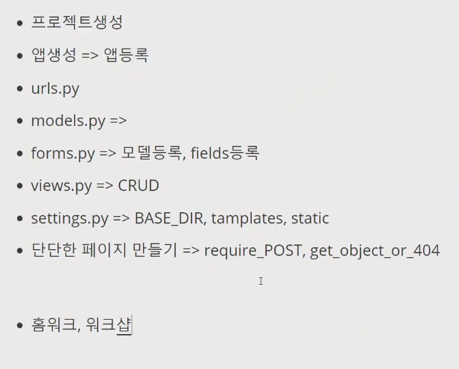

사진의 크기를 조정 RESIZE

장고 핀터레스트

CRUD MEDIA 꺼 사용하면됨

```
python -m venv venv
pip install -r requiemns
python manage.py migrate
imagekit 을 주석처리 세팅즈에잇음
w-100이면 백퍼센트 차지하게 된다. 단점 : 작은건 늘려서 너무커짐 고화질은 작아짐 등등..
우리가사용할건 django imagekit


pip install django-imagekit
위의 주석해제
아바타, 아바타썸네일

models.py
from imagekit.models imort ImageSpecField
image = models.IF(balnk=True)
이미지썸네일 = ISF(source='image'
				processors=[ResizeToFill(200,200)]),
				format='JPEG',
				options={'quality' : 60})
migration migrate : 변화없다 왜??

post.image_thumbnail.url >> html에서 수정하기
캐시폴더에 따로 저장된다 여기는 데이터베이스에 저장되는게아니라서 마이그레이트 안돼


이미지 주석처리하고 새로하깅
모델ㅈ.py
image = processedImaggeField()
migrate 이거는 데이터베이스 저장시키는거ㄹㅏ서 마이그레이트 가능
업로드투=폴더명 예) 'images/'
예) 'images/%Y/%m/%d' 하면 현재 날짜기준 2021/03/19/파일명.jpg


뉴와 에딧을 합치려면
form.html
create와 edit을 다 form.html로 바꿔줌
어떻게?
if와 else이용
주소가 create이면 = create 표시
update이면 update 표시
액션이 비워져있을때는 가능한 방법

django request ans object 검색

detail에 문제가?! : pk라는 값이 필요하다.
100번째 값을줘 : 그런거없어!라는 페이지가 필요하다. 
mdn status code : 오류코드확인

views.py 맨위에get_object_or_404
detial에 update에
get_object_or_404(POST, pk=pk)
꾸미고싶으면 404.html 만들어서 꾸미셈!
```

