## SQLite

> 가벼운 데이터베이스, 구글 안드로이드에 기본탑재
>
> db.sqlite
>
> 관계형 데이터베이스 관리시스템에서 사용할 특수목적의 프로그래밍 언어
>
> 


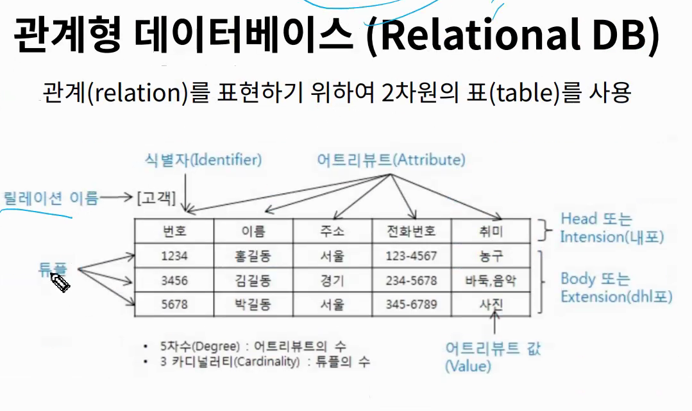

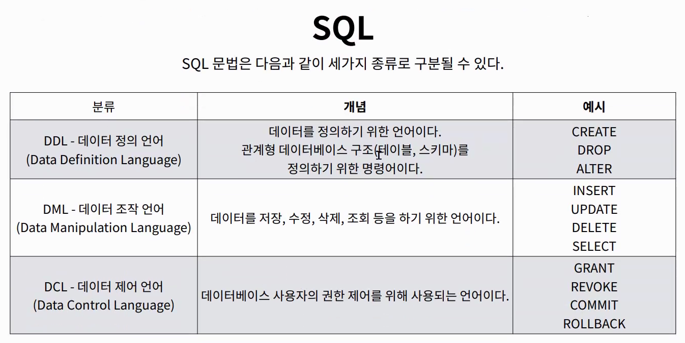


> 스키마 : 데이터베이스에서 자료의 구조, 표현방법, 관계 등을 정의한 구조
>
> id : int 등
>
> pk는 고유값 Primary Key 반드시 있어야하고 관리및 관계 설정시 주요하게 활용됨.


sqlite 설치하기  http://bit.ly/5gu_docs

99_sql만글고 csv파일을 넣어주기~

```
YN@DESKTOP-YENA MINGW64 ~/SSAFY5/exercise/django/0325/99_sql
$ sqlite3 tutorial.sqlite3
SQLite version 3.35.2 2021-03-17 19:07:21
Enter ".help" for usage hints.
sqlite> .databases
main: C:\Users\YN\SSAFY5\exercise\django\0325\99_sql\tutorial.sqlite3 r/w
sqlite> .mode csv
sqlite> .import hellodb.csv users_user # 파일명 테이블명(없으면생성)
```

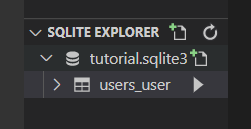

따란~ 복사되어따~~


100개짜리 해보좌~


#### 1. Hello, World! Hello, SQL!

```
sqlite>SELECT * FROM examples;
SELECT (보고싶은 필드자리) FROM (테이블자리);
```

여기는 백스페이스 안먹힌다네 다른데 써서 옮겨라!

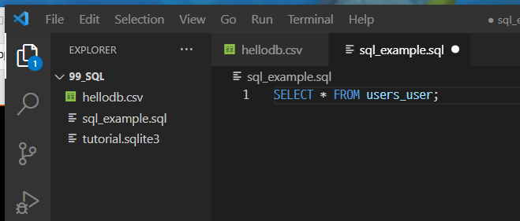

이런식으로 복붙 ㄱㄱ


좀더 예쁘게 보자!

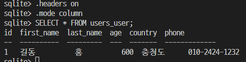


#### 테이블생성하기

```
CREATE TABLE 테이블명 (
	이름 타입 프라이머리키,
	이름 타입 # 여기 콤마찍으면 에러난디
)
```

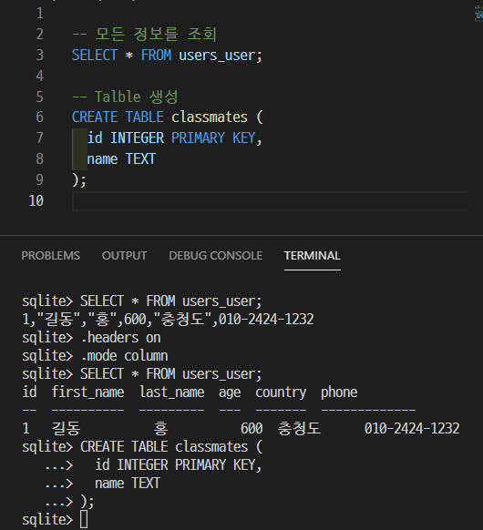

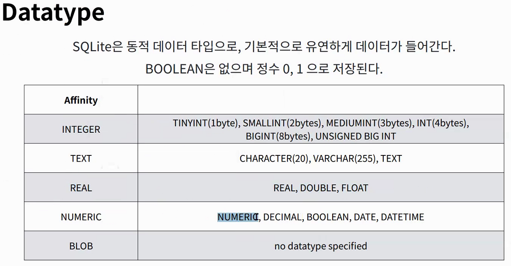

이러한 타입들이 있다.

```
테이블 목록 조회 
.tables
특정 테이블 스키마 조회
.schema table
```

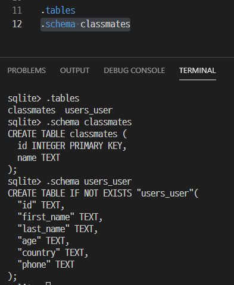

```
특정 테이블 삭제 DDL에 속함 (테이블은 DDL 데이터는 DML)
DROP TABLE 테이블명;
```

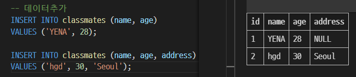

```sql
-- 모든 데이터를 넣을 때는 어디넣을건지 생략 가능
-- 처음에 id Primary key 설정해줬으면 아이디 빼먹지말고 넣어줘야해 (오토값이잇긴함)
INSERT INTO classmates
VALUES (3, 'YYN', 30, 'Seoul');
-- 아니라면 자동으로 123...이된다
INSERT INTO classmates
VALUES ('YYN', 30, 'Seoul');
```

프라이머리 키  id를 처음에 주지않으면 

알아서  rowid  컬럼을 자동으로 정의한다.


그리고 주소가 없는 (첫번째 NULL 처럼) 그런거 방지할라면 NOT NULL 할수있다

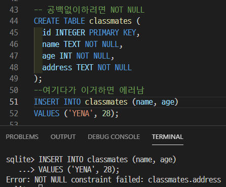

```sql
--여기다가 이거하면 에러남 (주소없음)
INSERT INTO classmates (name, age)
VALUES ('YENA', 28);
-- (id 없음)
INSERT INTO classmates
VALUES ('YENA', 28, 'SEOUL');
```


```sql
--한번에 데이터 여러개넣기
CREATE TABLE classmates (
  name TEXT NOT NULL,
  age INT NOT NULL,
  address TEXT NOT NULL
);
INSERT INTO classmates
VALUES ('hong', 23, 'Seoul'),
('Kim', 25, 'DaeJeon'),
('lee', 27, 'GwangJu'),
('Yoo', 28, 'Gumi');
```


```sql
-- DATA 조회(SELECT) 특정한 테이블에서 몇개만 가지고오고싶을떄
-- 아이디, 이름을 하나만 가져오고싶다면
SELECT rowid, name FROM classmates LIMIT 1;
-- 특정 위치에서 몇개만 가져오고싶다면
-- 0부터 시작하니까 3번째값 얻고싶으면 오프셋2 (시작점2)
SELECT rowid, name FROM classmates LIMIT 1 OFFSET 2;
-- 테이블에서 아이디, 네임,값 중 주소가 서울인사람 가져온다면
SELECT rowid, name FROM classmates
WHERE address='Gumi';
```

대소문자 상관없고 들여쓰기 엔터 상관없는데 가독성좋게하자

#### 세미콜론 빼먹으면 실행안됨~~


```sql
-- 중복 값 제거하기
INSERT INTO classmates
VALUES ('hong', 50, 'Busan');
SELECT rowid, name FROM classmates -- rowid는 중복값이 없어서 distict 못함
WHERE name='hong'; 
SELECT DISTINCT name FROM classmates
WHERE name='hong';

-- 데이터 삭제
--중복이 불가능한 rowid 기준으로하면 조음 
-- 조건이 없으면 모든 데이터 지워버림
-- id가 4인 데이터 삭제
DELETE FROM classmates 
WHERE rowid=4;
-- 이름이 hong인 사람 삭제
DELETE FROM classmates
WHERE name='hong';
-- 4번 id가 삭제되었지만 새로운값을 넣으면 새로 4번에 들어간다

-- 재사용안하고싶으면
-- AUTOINCREMENT 사용
CREATE TABLE tests(
id INTEGER PRIMARY KEY AUTOINCREMENT,
name TEXT NOT NULL);
INSERT INTO tests (name)
VALUES ('hong'), ('kim'), ('lee');
DELETE FROM tests
WHERE name='kim';
INSERT INTO tests (name)
VALUES ('kim');
-- 이렇게하면 마지막 kim은 아이디값이 4가 된다. 재사용안함.
-- 최적화를위해 잘 사용하지않지만 Django는 사용함 ㅎ..
```


```sql
-- UPDATE 데이터 수정
UPDATE 테이블명 SET column=value1, column2=value2,....
WHERE

UPDATE classmates
SET address='JEJU'
WHERE rowid=4;

SELECT rowid, * FROM classmates;
```

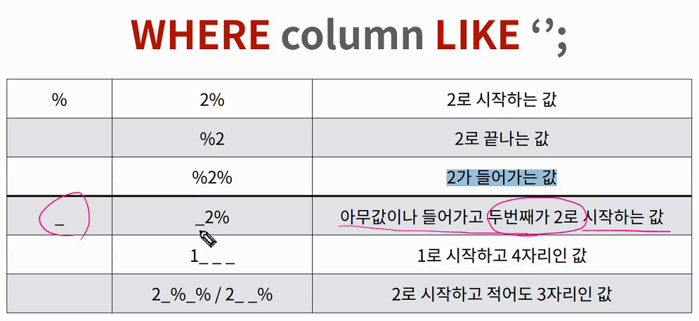

```sql
-- 다운받은 데이터 올리기~
.mode csv
.import users.csv users
SELECT * FROM users;

SELECT * FROM users
WHERE age >= 30;

-- 몇갠지 세고싶을때
SELECT COUNT(*) From users;

-- SELECT AVG(조건) From 테이블
-- AVG SUM MIN MAX 간ㅇ
-- 30살이상인 사람의 평균나이
SELECT AVG(age) From users
WHERE age >= 30;
-- 잔액이 높은사람과 액수
SELECT first_name, MAX(balance) From users;
-- 30살 이상인 사람의 계좌잔ㄱ액 평균
SELECT AVG(balance) FROM users
WHERE age >= 30;

-- Like(wild cards) ~처럼~같이
-- 패턴을 확인하여 해당하는 값 반환
-- SELECT * FROM table WHERE column LIKE'문자';
-- _ : 반드시 이자리에 한개의 문자가 존재해야한다
-- % : 이자리에 문자가 있을수도 없을수도 있다.

-- 20대인사람은
SELECT * FROM users
WHERE age LIKE '2_';

-- 지역번호가 02인사람
SELECT * FROM users
WHERE phon LIKE '02-%';

-- 이름이 준으로 끝나는 사람
SELECT * FROM users
WHERE first_name LIKE '%준';

-- 중간번호가 5114
SELECT * FROM users
WHERE phone LIKE '%-5114-%';
```


```sql
--묶어서조회
-- 각 성씨가 몇명?
SELECT last_name, COUNT(last_name)
FROM users
GROUP BY last_name;
-- AS를 이용하여 맨위에 항목이름을 지정해줄 수 있다.
SELECT last_name, COUNT(last_name) AS name_count
FROM users
GROUP BY last_name;
```

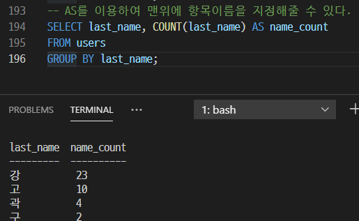

```sql
CREATE TABLE articles (
  title TEXT NOT NULL,
  content TEXT NOT NULL
);

INSERT INTO articles
VALUES ('1번글', '1번내용');
.tables

--테이블명 변경
ALTER TABLE articles 
RENAME TO news;
.tables

ALTER TABLE news
ADD COLUMN create_at TEXT NOT NULL;
-- 원래있던값에 크리에이트앳이 없기때문에 낫널하면 에러뜸
-- 없을경우 디폴트값을 정해주면 해결할 수 있다
ALTER TABLE news
ADD COLUMN create_at TEXT;
INSERT INTO news
VALUES('title','content', datetime('now'));
```

