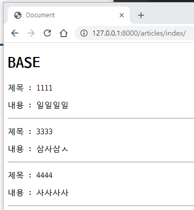
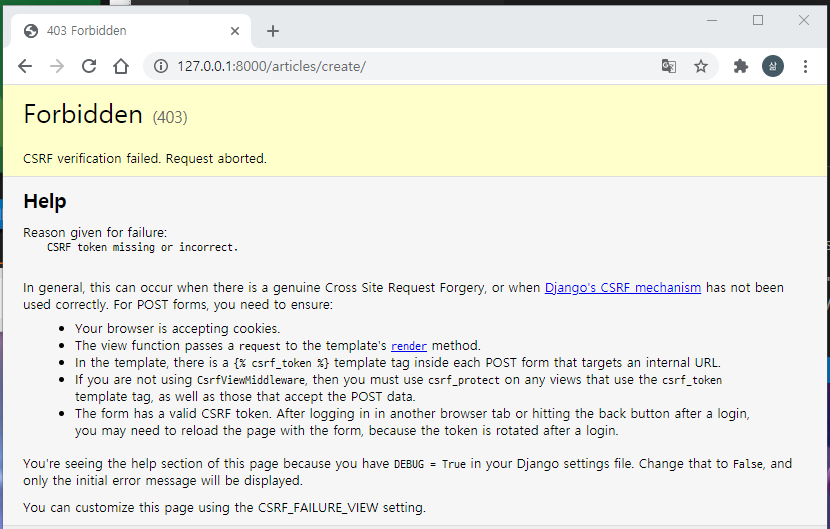
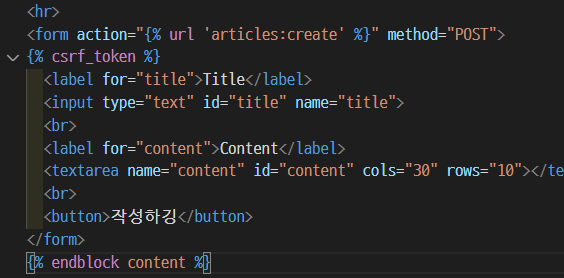

```
$ django-admin startproject crud
$ cd crud/
$ python manage.py startapp articles
# setting에 `articles`등록하고 crud/urls.py 에 includ하고
articles에 urls.py 생성
이제 템플릿 분리준비한대
기본폴더아래에 templates > Base.html (기본 html태그와 block태그 생성)
crud에 setting에 DIRS : [BASE_DIR / 'templates']
템플릿 확장준비가 끝낫댜~
데이터베이스 생성 model.py에 class생성
class Article(models.Model):
    title = models.CharField(max_length=100)
    content = models.TextField()
    create_at = models.DateTimeField(auto_now_add=True) # 생성시간
    update_at = models.DateTimeField(auto_now=True) # 업데이트 시간
    
    def __str__(self): # 관리자페이지에서 제목으로 볼수 있ㄱ게끔
        return self.title
모델즈.py 다썻다리~

터미널창에서 마이그레이션 파일만들기
$ python manage.py makemigrations
Migrations for 'articles':
  articles\migrations\0001_initial.py
    - Create model Article
    
$ python manage.py migrate
Operations to perform:
  Apply all migrations: admin, articles, auth, contenttypes, sessions
Running migrations:
  Applying contenttypes.0001_initial... OK
  Applying auth.0001_initial... OK
  Applying admin.0001_initial... OK
  
db.sqlite3 우클릭 오픈
articles_article : 폴더명, class 명

CRUD에서 R을 먼저하는게 좋타 > Index.html

articles/urls,py > path('index/', views.index, name='index'),
articles/views.py > from .models import Article > 
def index(request):
    # 함수에서 할 일이 있다.
    # DB에서 모든 글의 정보를 가지고 와야한다.
    articles = Article.objects.all()
    context = {
        'articles' : articles,
    }
    return render(request, 'articles/index.html', context)

templates/articles/index.html 생성하긔~




{{ articles }}



하고 서버실행 $ python manage.py runserver > http://127.0.0.1:8000/articles/index/

터미널에 + 버튼누르기
$ cd crud

파이썬 쉘~~ or admin
shell이용하기위해서는 djangoextention이용 > settings에 installedapps에 
'django_extensions', 등록

$ python manage.py shell_plus
In [1]: Article.objects.create(title='1111', content='일일일일')
Out[1]: <Article: 1111>
In [2]: Article.objects.create(title='3333', content='삼사삼ㅅ')
Out[2]: <Article: 3333>
강제로 데이터입력하기

articles/templates/articles/index.html



  <p>제목 : {{ article.title }}</p>
  <p>내용 : {{ article.content }}</p>
  <hr>


모든 글 목록을 볼 수 있게되엇삼 ㅎㅎ
```



여기까지가 R

------


```
templates/base.html에 추가사항
<a href="">새글쓰긔</a> #입력 폼으로 이동

articles/urls.py
path('new/', views.new, name='new'),

views.py
def new(request):
    return render(request, 'articles/new.html')
    
articles/templates/articles/new.html생성


<h2>새글쓰깅</h2>
<hr>
<form action="" method="GET">
  <label for="title">Title</label>
  <input type="text" id="title" name="title">
  <br>
  <label for="content">Content</label>
  <textarea name="content" id="content" cols="30" rows="10"></textarea>
  <br>
  <button>작성하깅</button>
</form>

이제 Create 페이지를 생성해야한다뤼 > 사용자가 글썼을때 글작성된거 데이터베이스에 저장해주깅
articles/urls.py
path('create/', views.create, name='create'),

views.py
인덱스를 호출해서 요청이 생겼을때 모든목록을 보여주는 페이지로 이동시킨다. redirect 사용해서 index경로로 요청한다. 사용하려면 
from django.shortcuts import render, redirect << 추가해줘야함 
관련 정보는 django shortcut 문서 찾아보깅

def create(request):
    # 할일이 있다. DB에 입력받은 내용을 저장해야한다.
    # 입력받은내용은 리퀘스트에 들어있따
    title = request.GET.get('title') 
    content = request.GET.get('content')
    # DB에 저장하긩
    article = Article.objects.create(title=title, content=content)
    return redirect('articles:index')
```


HTTP Method

GET : 데이터 조회

POST :  데이터 수정 생성 삭제


new.html에서 GET 대신 POST를 쓰면 작성할때 오류가뜬다!



진짜 누구세요? ㅜㅜ

articles/views.py에 create부분에서

  title = request.POST.get('title') 

  content = request.POST.get('content')

이렇게 바꿔줘야함. 근데왜안돼...



csrf_token이거추가안했으니까 안되지!!


index.html에서 >내용 :< 부분 지움

```
<p>제목 : <a href="">{{ article.title }}</a></p>
```

이렇게 입력쓰

urls.py에서 path('detail/<int:id>/', views.detail, name='detail'),

view.py에서

```
def detail(request, id):
    article = Article.objects.get(pk=id)
    context = {
        'article' : article,
    }
    return render(request, 'articles/detail.html', context)
```


detail.html생성

```



<p>{{article.id}} 번 글</p>
<p>제목 : {{article.title}}</p>
<p>내용 : {{article.content}}</p>
<a href=""> 목록으로 </a>

```

여기까지 CR완벽하게 끗


수정할겨

```
detail.html에서
<a href="">수정</a>
<a href="#">삭제</a> 추가하기

path('edit/', views.edit, name='edit'),

def edit(request):
    return render(request, 'articles/edit.html')
    
edit.html생성후


<h2>쑤정하긔</h2>
<hr>
<form action="" method="POST">
  
  <label for="title">Title</label>
  <input type="text" id="title" name="title" value="{{ article.title }}">
  <br>
  <label for="content">Content</label>
  <textarea name="content" id="content" cols="30" rows="10">
    {{ article.content }}
  </textarea>
  <br>
  <button>수정하깅</button>
</form>


path('update/', views.update, name='update')

어떤글을 수정해야할지 알기위해 detail.html에서 
<a href="">수정</a> 로 수정해준다.

path('edit/<int:id>/', views.edit, name='edit'),

def edit(request, id):
    article = Article.objects.get(pk=id)
    context = {
        'article' : article,
    }
    return render(request, 'articles/edit.html', context)
    
path('update/<int:id>/', views.update, name='update')

```


살제하긔

```
<a href="">삭제</a>

path('delete/<int:id>/', views.delete, name='delete'),

def delete(request, id):
    # 삭제하려는 값을 DB에서 가져온다.
    article = Article.objects.get(pk=id)

    # 삭제한다.
    article.delete()

    return redirect('articles:index')
```

