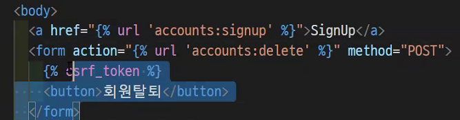

url 분리부터 시작

`path('accounts/'), include(''))`

urls.py 작성하기

앱네임설정해주고 urlpatterns = []


- 회원가입부터 해보자!


```python
urls.py

path('signup/', views.signup, name='signup'),


views.py

from django.contrib.auth.forms import UserCreationForm
(django.contrib.auth) 이거는 거의 공통

def signup(request):
	if request.method == 'POST':
		form = UserCreationForm(request.POST)
        if form.is_valid():
            form.save()
            return redirect('articles:index')
	else:
		form = UserCreationForm()
	
	context = {
		'form' : form
	}
	return render(request, 'accounts/signup.html', context)
	
그다음에 html 만들어준다.

```


```html
templates/accounts/signup.html

extends, block

<form action="" method="POST">
    
    {{ form.as_p }}
</form>
```


하고 회원 탈퇴를 만들어야한다.

```
urls.py
# 똑같은 delete가 있지만 앱네임으로 구분하였기때문에 같아도 상관없음
path('delete/', view.delete, name='delete')

지우는것은 a태그로 사용하면 안되고 form태그를 사용한다. method = POST
```



articles에서 는 우리가 데이터베이스에서 가져와서삭제햇는데

이미 리퀘스트유저에 정보가있기때문에 그걸 지우면된다.


UserChangeForm 을 사용할건데 커스텀을 해줘야 권한을 설정할수있다?

그래서 forms.py 를 수정한다.

accounts에forms.py만든다.

```
from django.contrib.auth.forms import UserChangeForm
from django.contrib.auth import get_user_model

class CustomUserChangeForm(UserChangeForm):
	class Meta:
		model = get_user_model()
		fields = ['email', 'first_name', 'last_name']
```


업데이트도 패쓰부터 시작

```
path('update/', view.update, name='update'),

맨위에 이거추가해조
from .forms import CustomUserChangeForm

def update(request):
	if request.method = 'POST':
		form = CustomUserChangeForm(request.POST, instance=request.user)
		if form.is_valid():
			form.save()
			return 
	else:
		form = CustomUserChangeForm(instance=request.user)
	context = {
		'form' : form
	}
	return render(request, 'accounts/update.html', context)		
그리고 이제 update.html 만들기~~


```

